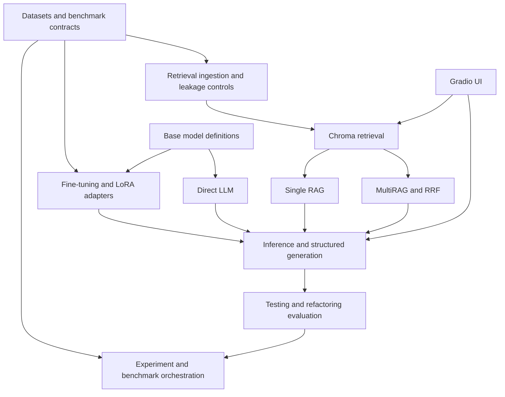

# Project map

## Project overview

The repository is one research project with several independent, active areas.
Dataset preparation establishes controlled inputs; fine-tuning changes model
weights; retrieval changes the evidence available at inference time; inference
executes model requests; evaluation measures outputs; experiment orchestration
selects and compares configurations; and the UI exposes the shared services for
interactive inspection.



The arrows describe data/control flow, not package import direction in every
case. Fine-tuning and retrieval are experimental variables that can be evaluated
independently or composed deliberately.

## Shared infrastructure

Shared code is deliberately small:

- `src/llm_ontology/core/`: configuration parsing, paths, logging, task names,
  and reproducibility-lock validation;
- `src/llm_ontology/providers/`: external model/runtime provider contracts;
- `src/llm_ontology/models/`: lazy HF model, tokenizer, quantization, and LoRA
  loading used across fine-tuning and model evaluation;
- `configs/shared/`: base settings, model definitions, and environment locks.

These packages contain no benchmark aggregation or retrieval ranking policy.

## Datasets

Status: **ACTIVE**

Implementation is under `src/llm_ontology/datasets/`; commands are under
`scripts/datasets/`; role and split definitions are under `configs/datasets/`;
tests are under `tests/datasets/`; materialized data remains under `data/`.

- **Methods2Test** supplies Java production-method/JUnit pairs and preserves its
  official project-disjoint splits.
- **ML4Refactoring** supplies before/after refactoring pairs extracted through a
  safe, traceable project pipeline.
- **MaRV** supplies reviewed refactoring examples and stratified preparation.
- **TestBench** is exposed read-only through `llm_ontology.benchmarks` with
  controlled source/simple/full context variants.
- **SWE-Refactor** is exposed through the same benchmark contract with reference
  and compile/project metadata.
- **handcrafted_smoke_v1** lives in `data/smoke/`; its manifest forbids indexing
  and its evaluator-only expectations never belong in model prompts.

`src/llm_ontology/benchmarks/` remains a top-level package because it cohesively
owns both read-only dataset adapters and the execution metadata required by
those benchmark contracts. Splitting it would obscure, rather than clarify, the
benchmark boundary.

## Fine-tuning

Status: **ACTIVE**

- implementation: `src/llm_ontology/finetuning/`;
- training engine/readiness: `src/llm_ontology/finetuning/training/`;
- configurations: `configs/finetuning/` plus shared model definitions in
  `configs/shared/models/`;
- commands: `scripts/finetuning/`;
- tests: `tests/finetuning/` and cross-area prompt/generation tests;
- handoff metadata/placeholders: `artifacts/finetuning/`;
- documentation: `docs/finetuning/`.

This area owns instruction-dataset loading, training prompt formatting, QLoRA,
LoRA adapters, label masking, training readiness, checkpoint/resume behavior,
and adapter packaging. Fine-tuning is not a subtype of RAG and is not considered
obsolete when a retrieval smoke run uses only the base model.

## Retrieval / RAG / MultiRAG

Status: **ACTIVE**

- `src/llm_ontology/ingestion/`: role manifests, fingerprints, leakage checks,
  Java/pair-aware chunking, and production corpus construction;
- `src/llm_ontology/vectorstore/`: Chroma storage, collection lifecycle, and
  embedding identity sidecars;
- `src/llm_ontology/retrieval/`: provider factories, retrieval requests/results,
  Single RAG, MultiRAG, RRF, deduplication, context budgets, and traces;
- `configs/retrieval/` and `configs/embeddings/`: runtime/retrieval definitions;
- `scripts/retrieval/`: production index and environment maintenance commands;
- `tests/retrieval/`: retrieval, index, embedding, and WSL runtime contracts;
- `artifacts/retrieval/`: ignored index/report material and tracked placeholders;
- `docs/retrieval/`: RAG phases and Ollama embedding lifecycle.

`ingestion` and `vectorstore` remain top-level packages as explicit architectural
boundaries: ingestion is provider-independent corpus construction, while
vectorstore isolates persistence. Both are owned by the retrieval research area.

## Inference

Status: **ACTIVE**

`src/llm_ontology/inference/` owns prompt formatting, approach preparation,
Ollama generation, structured output validation/repair, standalone inference,
and the shared Direct/RAG/MultiRAG experiment runner. `src/llm_ontology/approaches/`
holds the mode-specific prompt strategies behind typed contracts. Inference
consumes datasets/model providers/retrieval results; it does not prepare training
datasets or aggregate benchmark reports.

Commands and configs remain in `scripts/inference/` and `configs/inference/`.
Inference-specific tests are under `tests/inference/`, with cross-area
compatibility tests retained at the test root.

## Evaluation

Status: **ACTIVE**

`src/llm_ontology/evaluation/` owns normalized prediction IO, HF/LoRA inference
evaluation, testing/refactoring metrics, code/text proxies, coverage integration,
aggregation, and report generation. Commands and configs remain under
`scripts/evaluation/` and `configs/evaluation/`; tests are under
`tests/evaluation/`; runbooks are under `docs/evaluation/`. Generated runs use
the single validated namespace `artifacts/evaluation/runs/<run_id>/`; CLI
output guards reject new root-level `evaluation*` directories.

Testing and refactoring have separate task metrics. Compile/test execution and
behavior-preservation checks are part of their benchmark/smoke evaluators; proxy
metrics are not presented as substitutes for executable validation.

## Experiments

Status: **ACTIVE**

Experiments answer which dataset cases, approach/mode, model configuration, and
evaluation protocol are run and compared. Controlled Direct/RAG/MultiRAG cells
are under `configs/experiments/`. Benchmark and smoke commands are grouped under
`scripts/experiments/benchmarks/`; corresponding tests are under
`tests/experiments/`; design and runbooks are under `docs/experiments/`.

`src/llm_ontology/experiments/` contains the resumable `SmokeExperimentRunner`,
canonical prompt fairness audit, report aggregation, and the
`python -m llm_ontology.experiments.smoke` CLI. Its default configuration is
`configs/experiments/baseline_v1.yaml`: 24 handcrafted cases across Direct,
Single RAG, and MultiRAG (72 planned cells). The runner delegates retrieval,
structured generation, prompt artifacts, and metrics to the existing shared
inference/retrieval/evaluation components. `baseline_v1` is immutable and
preflight-protected by a portable fingerprint, live model digests, prompt
hashes, dataset identity, and collection manifest identities. Each invocation
writes immutable `effective_config.yaml` and `environment.json` snapshots; raw
run history is aggregated only for the active baseline fingerprint.

## UI

Status: **ACTIVE**

`src/llm_ontology/ui/` is a thin Gradio presentation and debug layer over shared
retrieval, inference, provider, environment-status, and experiment-record
services. It does not build indexes or implement a separate model pipeline.
Configuration is in `configs/ui/`, tests in `tests/ui/`, and documentation in
`docs/ui/`.

## Repository navigation

```text
configs/                     area-owned and shared experiment definitions
src/llm_ontology/datasets/   dataset preparation and normalized contracts
src/llm_ontology/finetuning/ active LoRA/QLoRA research line
src/llm_ontology/retrieval/  search, fusion, budgeting, and trace
src/llm_ontology/inference/  prompt/model execution and structured output
src/llm_ontology/evaluation/ metrics, executable checks, prediction IO, reports
src/llm_ontology/experiments/ resumable smoke orchestration and fairness audit
scripts/experiments/         benchmark/experiment orchestration commands
src/llm_ontology/ui/         interactive presentation and diagnostics
```

Potential consolidations are intentionally conservative. See
`cleanup_candidates.md` for retained candidates and
`legacy_cleanup_report.md` for the dedicated cleanup result.
